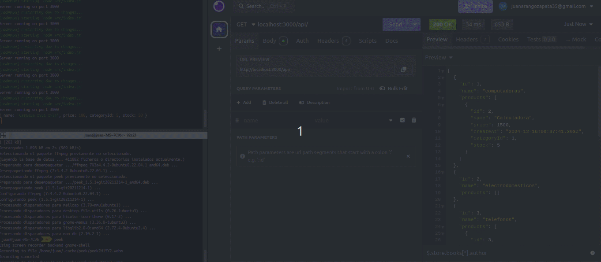

# 🌟 Api Rest

Una API REST básica utilizando Prisma y Express para manejar productos y categorías proporciona un sistema para realizar operaciones CRUD (Crear, Leer, Actualizar, Eliminar) sobre estas dos entidades.

## 🚀 Funcionalidades del Proyecto

### 1.OBTENER PRODUCTOS:

**Ruta: GET /api/products**

Esta ruta devuelve todos los productos almacenados en la base de datos. Los productos se retornan en formato JSON y pueden incluir información como el nombre, descripción, precio y la categoría a la que pertenecen (si está definida la relación con categorías).

**Comportamiento esperado:**

-*La API consulta la base de datos mediante prisma para recuperar todos los productos.*
-*Los productos se devuelven en un array de objetos JSON.*
-*Si no hay productos, la respuesta será un array vacío [].*
-*Si ocurre algún error durante la consulta, se devuelve un mensaje de error adecuado.*

