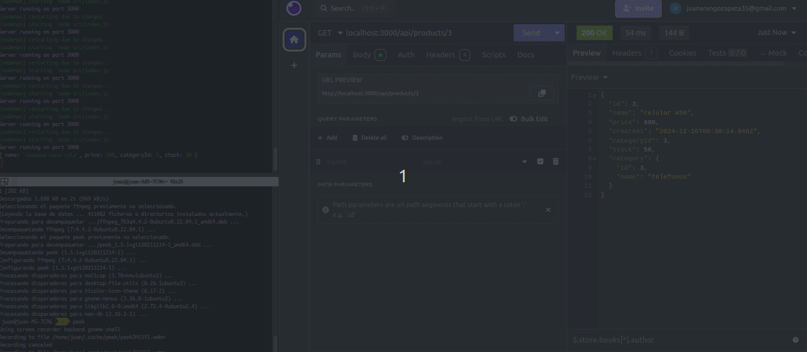
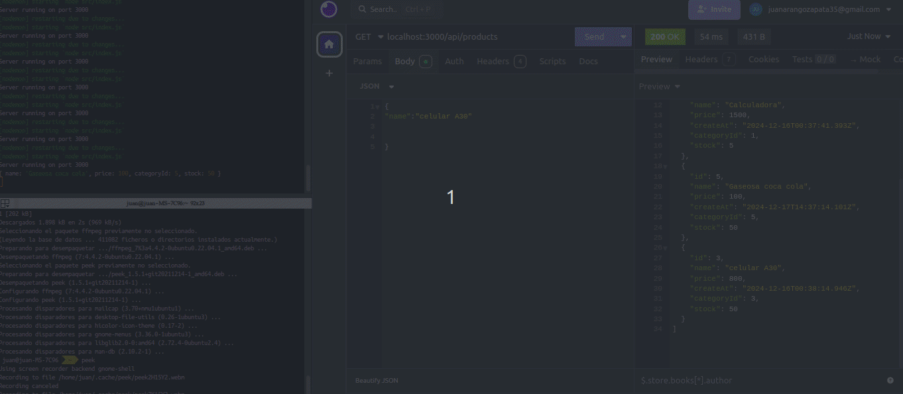
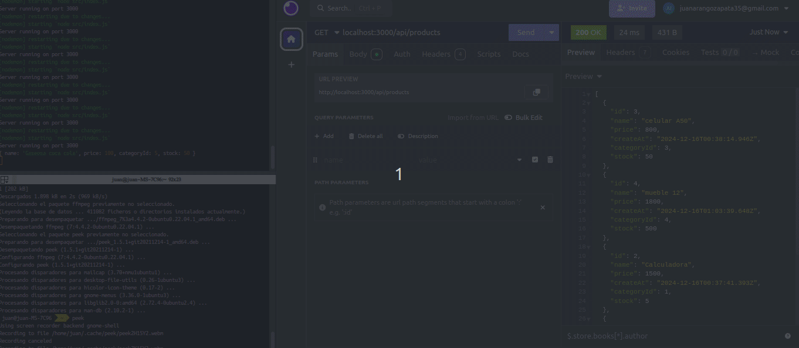
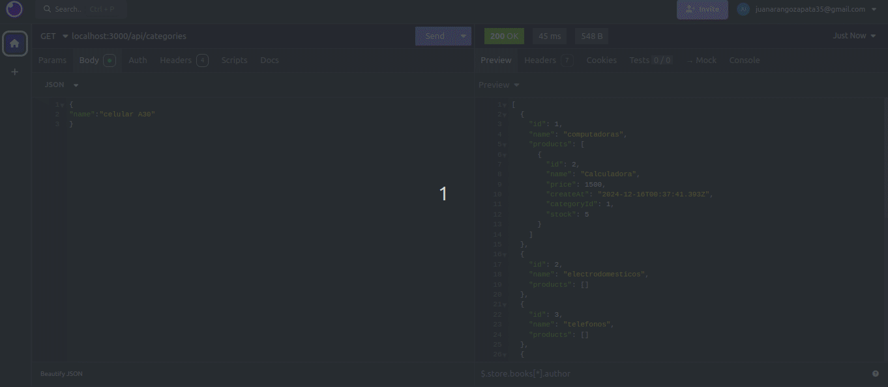
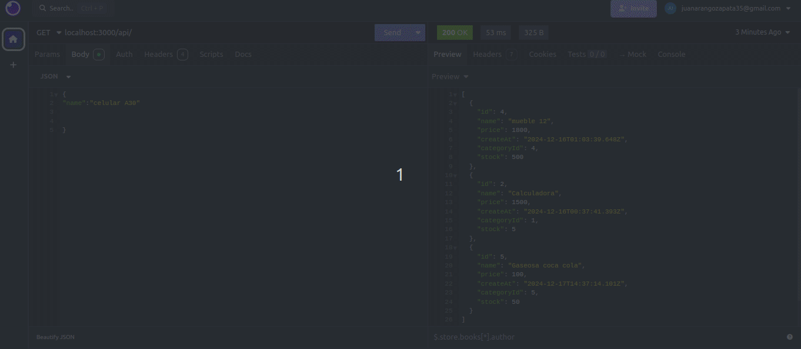

# 🌟 API REST

Una API REST básica utilizando Node, Prisma y Express para manejar productos y categorías proporciona un sistema para realizar operaciones CRUD (Crear, Leer, Actualizar, Eliminar) sobre estas dos entidades.

## 🚀 Funcionalidades del Proyecto

### 1.OBTENER PRODUCTOS:

**Ruta: GET /api/products**

Esta ruta devuelve todos los productos almacenados en la base de datos. Los productos se retornan en formato JSON y pueden incluir información como el nombre, descripción, precio y la categoría a la que pertenecen (si está definida la relación con categorías).

**Comportamiento esperado:**

-*La API consulta la base de datos mediante prisma para recuperar todos los productos.*
-*Los productos se devuelven en un array de objetos JSON.*
-*Si no hay productos, la respuesta será un array vacío [ ].*
-*Si ocurre algún error durante la consulta, se devuelve un mensaje de error adecuado.*

### 2.ACTUALIZAR PRODUCTO:

**Ruta: PUT /api/products/:id**

Esta ruta permite actualizar un producto existente en la base de datos. Debes proporcionar un identificador de producto (id) y un objeto JSON con los nuevos datos que deseas aplicar al producto. Los datos pueden incluir el nombre, descripción, precio o la categoría a la que pertenece.

**Comportamiento esperado:**

-*La API buscará el producto en la base de datos utilizando el id proporcionado en la URL.*
-*Si el producto existe, se actualizará con los datos proporcionados en el cuerpo de la solicitud*
-*La respuesta incluirá el producto actualizado en formato JSON*
-*Si el producto no existe, se devuelve un mensaje de error 404 Not Found.*

### 3.ELIMINAR PRODUCTO:

**Ruta: DELETE /api/products/:id**

Esta ruta permite eliminar un producto específico de la base de datos, basándose en el identificador (ID) proporcionado en la URL. El producto con el ID correspondiente será eliminado de forma permanente.

**Comportamiento esperado:**

-*La API consulta la base de datos para encontrar el producto con el ID especificado.*
-*Si el producto existe, se elimina de la base de datos.*
-*Si el producto no se encuentra, se devuelve un mensaje de error.*
-*Si ocurre un error durante la eliminación, se devuelve un mensaje adecuado.*

### 4.TRAER UNICO PRODUCTO POR SU ID:

**Ruta: GET /api/products/:id**

Esta ruta devuelve los detalles de un único producto basado en su identificador (ID) proporcionado en la URL. El producto se devuelve en formato JSON, incluyendo todos los campos relevantes como nombre, descripción, precio, y la categoría a la que pertenece.

**Comportamiento esperado:**

-*La API consulta la base de datos para encontrar el producto con el ID especificado.*
-*Si el producto existe, devuelve un objeto JSON con los detalles del producto.*
-*Si el producto no se encuentra, se devuelve un error con un mensaje adecuado.*

### 5.CREAR CATEGORIA:

**Ruta: POST /api/categories**

Esta ruta permite crear una nueva categoría en la base de datos. El cliente debe enviar un objeto JSON en el cuerpo de la solicitud con el nombre de la categoría. Una vez creada, la categoría se guarda en la base de datos y se devuelve un objeto JSON con la información de la categoría recién creada.

**Comportamiento esperado:**

-*La API recibe la información de la nueva categoría en el cuerpo de la solicitud (nombre de la categoria).*
-*Si la categoría no existe, la API crea una nueva categoría con el nombre proporcionado.*
-*La categoría creada se guarda en la base de datos y se devuelve con un código de respuesta 201 Created.*
-*Si ocurre algún error durante la creación (por ejemplo, si el nombre de la categoría ya existe o hay problemas de validación), la API devuelve un mensaje de error adecuado.*

### 6.TRAER CATEGORIAS:

**Ruta: GET /api/categories**

Esta ruta permite obtener todas las categorías almacenadas en la base de datos. La respuesta es un array de objetos JSON que contienen los detalles de cada categoría, como su id y name, además de los productos que se encuentran en el. Si no existen categorías, la respuesta será un array vacío.

**Comportamiento esperado:**

-*La API realiza una consulta a la base de datos para recuperar todas las categorías disponibles.*
-*Las categorías se devuelven en un array JSON.*
-*Si no se encuentran categorías, se devuelve un array vacío [ ].*
-*Si ocurre algún error durante la consulta, se devuelve un mensaje de error con el código 500 Internal Server Error.*

### 7. TECNOLOGÍAS UTILIZADAS:
- 🖥️ **NODE** – Entorno de ejecución de JavaScript en el servidor, basado en el motor V8 de Chrome, que permite crear aplicaciones de backend..
- 🖥️ **EXPRESS** – Framework minimalista para Node.js que facilita la creación de aplicaciones web y APIs mediante el manejo de rutas y solicitudes HTTP.
- 🖥️ **PRISMA** – ORM (Object-Relational Mapper) que simplifica la interacción con bases de datos en Node.js, proporcionando un cliente fácil de usar para operaciones CRUD.

- 🖥️ **INSOMNIA** – Herramienta para probar APIs RESTful y GraphQL, que permite enviar solicitudes HTTP y visualizar las respuestas de manera interactiva.

Estas tecnologías en conjunto permiten construir una API RESTful eficiente, con un backend robusto gracias a Node.js y Express.js, y una integración sencilla con la base de datos utilizando Prisma. La herramienta Insomnia facilita las pruebas y la depuración de las rutas de la API, mientras que GitHub asegura un control de versiones adecuado y la posibilidad de colaboración. En conjunto, proporcionan una solución ágil y escalable para gestionar productos y categorías en una aplicación web.

### 8. 😊 AGRADECIMIENTOS:
Quiero expresar mi sincero agradecimiento a Codeable  mi academia y algunos videos tutoriales de youtube, por brindarme las herramientas y conocimientos necesarios para desarrollar este proyecto. También comentarles que este proyecto esta en proceso y se pueden implementar varias coas más como paginación, etc, espero que en lo posterios pueda hacer más robusta esta aplicación. ¡Gracias a todos por hacer de esta experiencia un aprendizaje valioso y enriquecedor!
